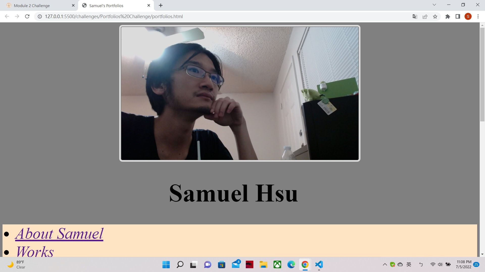
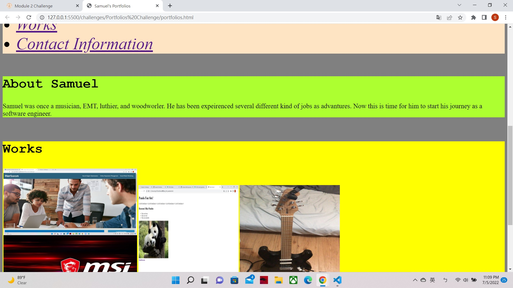
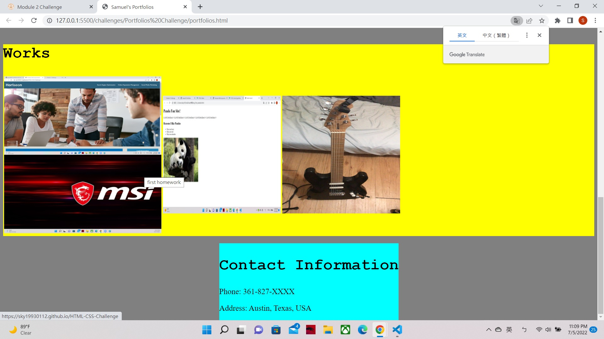

# Portfolios
*I put avatar and  developer's name on header section

*I put links to sections in nav as a list; also make each link connect to corresponding section.

*I put titled tags on each image in Works section which is line 30 in HTML. so that everytime hoover around the picture link will triger the text tags which describe the picture and link.

*The first developer's application has set to larger size in line 34 in HTML. Also has functional link to the deployed application which was my first challenge assignment. However, other works just pictures of my works instead of real deployed application; 3rd picture was the electric guitar I build in the past.

*I had tried to set flext and wrap in nav, section1 and section 2 in CSS for the purpose of fitting web-page when changing the display size. The flex-wrap function is working on nav when inspecting the Live Server and move around. But somehow the flex-wrap function does not work on section 2 (works); I have not able to figure out how to fix it yet.

link to deployed application(https://sky19930112.github.io/Portfolios/)

